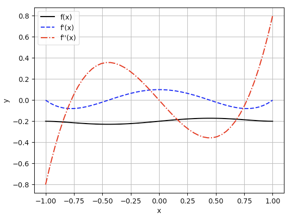

<!--
 * @Author: Uper 41718895+Hyliu-BUAA@users.noreply.github.com
 * @Date: 2022-06-29 21:30:46
 * @LastEditors: Uper 41718895+Hyliu-BUAA@users.noreply.github.com
 * @LastEditTime: 2022-06-30 21:01:56
 * @FilePath: /Quantum_Mechanics/CodeForQM/1.解薛定谔方程/notes/1.一维有限差分法md
 * @Description: 这是默认设置,请设置`customMade`, 打开koroFileHeader查看配置 进行设置: https://github.com/OBKoro1/koro1FileHeader/wiki/%E9%85%8D%E7%BD%AE
-->
# 微分的`有限差分法`（ `Finite Difference Metohd`, `FDM` ）
https://www.youtube.com/watch?v=kkiVU--r9pI

# 1. Numerical Differentiation by Definition
1. The `first derivative at x` is defined by using limits as:
$$ f'(x) = \frac{df(x)}{dx} = \lim_{\Delta\rightarrow0}\frac{\Delta f(x)}{\Delta x} $$

2. Numerically, $\Delta x$ cannot be infinitesimal, so it should be finite and solution becomes approximate:
$$ f'(x) \approx \frac{f(x+\Delta x) - f(x)}{\Delta x} $$

$$Let\begin{cases}
x &\rightarrow x_i   \\
x+\Delta x &\rightarrow  x_{i+1}    \\
\Delta x &\rightarrow h
\end{cases}$$

3. So,
$$ f'(x) \approx \frac{f(x_{i+1}) - f(x_i)}{h} $$

# 2. Forward Finite Difference
1. By applying `Taylor series expansion`:
$$\begin{aligned}
f(x) = f(a) + \frac{f'(a)}{1!}(x-a) + \frac{f''(a)}{2!}(x-a)^2 + \frac{f'''(a)}{3!}(x-a)^3 + ...
\end{aligned}$$

$$Let\begin{cases}
x &\rightarrow x_{i+1}   \\
a &\rightarrow  x_i    \\
(x - a) = (x_{i+1} - x_i) &\rightarrow h
\end{cases}$$

2. So, 
$$\begin{aligned}
f(x_{i+1}) = f(x_i) + f'(x_i)h + \frac{f''(x_i)}{2!}h^2 + \frac{f'''(x_i)}{3!}h^3 + ...
\end{aligned}$$

3. So, 
$$\begin{aligned}
f'(x_i) = \frac{f(x_{i+1}) - f(x_i)}{h} - \frac{f''(x_i)}{2!}h - \frac{f'''(x_i)}{3!}h^2
\end{aligned}$$

## 2.1. Higher Derivatives
1. Forward finite differences. Errors: $O(h)$
$$\begin{aligned}
f'(x_i) &= \frac{f(x_{i+1}) - f(x_i)}{h} \\
f''(x_i) &= \frac{f(x_{i+2})-2f(x_{i+1})+f(x_i)}{h^2}   \\
f'''(x_i) &= \frac{f(x_{i+3}) - 3f(x_{i+2}) + 3f(x_{i+1}) - f(x_i)}{h^3}
\end{aligned}$$

# 3. Backward Finite Difference 
1. 由 `Taylor Series Expansion`:
$$Let\begin{cases}
x &\rightarrow x_{i-1}   \\
a &\rightarrow  x_i    \\
(x - a) = (x_{i-1} - x_i) &\rightarrow (-h)
\end{cases}$$

2. So, 
$$\begin{aligned}
f(x_{i-1}) = f(x_i) - f'(x_i)h + \frac{f''(x_i)}{2!}h^2 - \frac{f'''(x_i)}{3!}h^3 + ...
\end{aligned}$$

3. So, 
$$\begin{aligned}
f'(x_i) = \frac{f(x_i) - f(x_{i-1})}{h} + \frac{f''(x_i)}{2!}h - \frac{f'''(x_i)}{3!}h^2
\end{aligned}$$

## 3.1. Higher Derivatives
1. Forward finite differences. Errors: $O(h)$
$$\begin{aligned}
f'(x_i) &= \frac{f(x_{i}) - f(x_{i-1})}{h} \\
f''(x_i) &= \frac{f(x_{i})-2f(x_{i-1})+f(x_{i-2})}{h^2}   \\
f'''(x_i) &= \frac{f(x_{i}) - 3f(x_{i-1}) + 3f(x_{i-2}) - f(x_{i-3})}{h^3}
\end{aligned}$$

# 4. <font color="73DB90">Central Finite Difference</font>
1. `2.2式 - 3.2式`，得
$$\begin{aligned}
f'(x_i) = \frac{f(x_{i+1}) - f(x_{i-1})}{2h}
\end{aligned}$$

## 4.1. Higher Derivatives
1. Forward finite differences. Errors: $O(h)$
$$\begin{aligned}
f'(x_i) &= \frac{f(x_{i+1}) - f(x_{i-1})}{2h} \\
f''(x_i) &= \frac{f(x_{i+1})-2f(x_{i})+f(x_{i-1})}{h^2}   \\
f'''(x_i) &= \frac{f(x_{i+2}) - 2f(x_{i+1}) + 2f(x_{i-1}) - f(x_{i-2})}{2h^3}
\end{aligned}$$


# 5. Example 1
## 5.1. What to do?
1. Find the first and second derivatives of the following polynomial at `x=0.1`
$$ f(x) = 0.1x^5 - 0.2x^3 + 0.1x - 0.2 $$
2. Compare numerical solutions at `h=0.1, 0.01 and 0.001`.
3. The `analytical differentiation` yields
$$\begin{cases}
f'(0.1) = 0.09405   \\
f''(0.1) = -0.118
\end{cases}$$

## 5.2. Code and Output
```python
from prettytable import PrettyTable
from sqlalchemy import func

function = lambda x: 0.1*pow(x, 5) \
                    - 0.2*pow(x,3)  \
                    + 0.1*x - 0.2

# Customer Parameters
x = 0.1
h = 0.1

df1_analytic = 0.09405   # function 的一阶微分
df2_analytic = -0.0118   # function 的二阶微分


# Output function
def output(df1: float, df1_error: float, df2: float, df2_error: float):
    table = PrettyTable(["df1", "df1_error", "df2", "df2_error"])
    table.add_row([df1, df1_error, df2, df2_error])
    print(table)


# 1. Forward differences
df1 = ( function(x+h) - function(x) ) / h
df2 = ( function(x+2*h) - 2*function(x+h) + function(x) ) / pow(h, 2)
output(df1, df1-df1_analytic, df2, df2-df1_analytic)


# 2. Backward differences
df1 = ( function(x) - function(x-h) ) / h
df2 = ( function(x) - 2*function(x-h) + function(x-2*h) ) / pow(h, 2)
output(df1, df1-df1_analytic, df2, df2-df1_analytic)


# 3. Central differences
df1 = ( function(x+h) - function(x-h) ) / (2*h)
df2 = ( function(x+h) - 2*function(x) + function(x-h) ) / pow(h, 2)
output(df1, df1-df1_analytic, df2, df2-df1_analytic)
```
Output:
```shell
+---------------------+----------------------+----------------------+---------------------+
|         df1         |      df1_error       |         df2          |      df2_error      |
+---------------------+----------------------+----------------------+---------------------+
| 0.08606299999999983 | -0.00798700000000016 | -0.23397999999999747 | -0.3280299999999975 |
+---------------------+----------------------+----------------------+---------------------+
+---------------------+----------------------+-----------------------+----------------------+
|         df1         |      df1_error       |          df2          |      df2_error       |
+---------------------+----------------------+-----------------------+----------------------+
| 0.09800100000000006 | 0.003951000000000066 | 2.000000000057511e-05 | -0.09402999999999942 |
+---------------------+----------------------+-----------------------+----------------------+
+---------------------+------------------------+----------------------+----------------------+
|         df1         |       df1_error        |         df2          |      df2_error       |
+---------------------+------------------------+----------------------+----------------------+
| 0.09203199999999995 | -0.0020180000000000475 | -0.11938000000000223 | -0.21343000000000223 |
+---------------------+------------------------+----------------------+----------------------+
```


# 6. Example 1
## 6.1. What to do?
1. Find the first and second derivatives of the following function within the domain `[-1, 1]` by using `central finite differences` then plot the graphs. Let `h = 0.01`
$$ f(x) = 0.1x^5 - 0.2x^3 + 0.1x - 0.2 $$

## 6.2. Code and Output
```python
import numpy as np
import matplotlib.pyplot as plt


function = lambda x: 0.1*np.power(x, 5) \
                    - 0.2*np.power(x,3)  \
                    + 0.1*x - 0.2

# Customer Parameters
x = np.linspace(-1, 1)
h = 0.01


# 1. Central differences
df1 = ( function(x+h) - function(x-h) ) / (2*h)
df2 = ( function(x+h) - 2*function(x) + function(x-h) ) / pow(h, 2)


# 2. plot
plt.plot(x, function(x), '-k', x, df1, '--b', x, df2, '-.r')
plt.xlabel('x')
plt.ylabel('y')
plt.legend(["f(x)", "f'(x)", "f''(x)"])
plt.grid()
plt.show()
```
Output:
