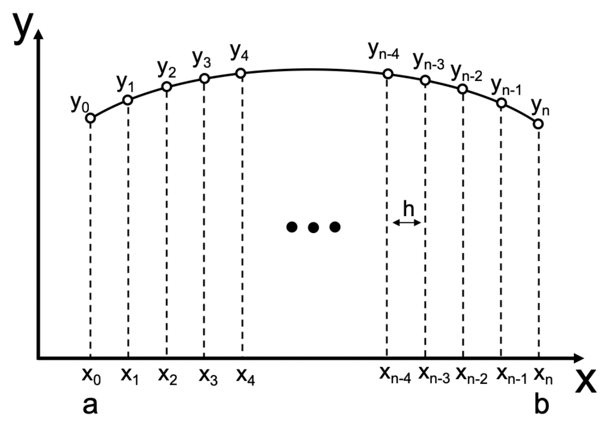
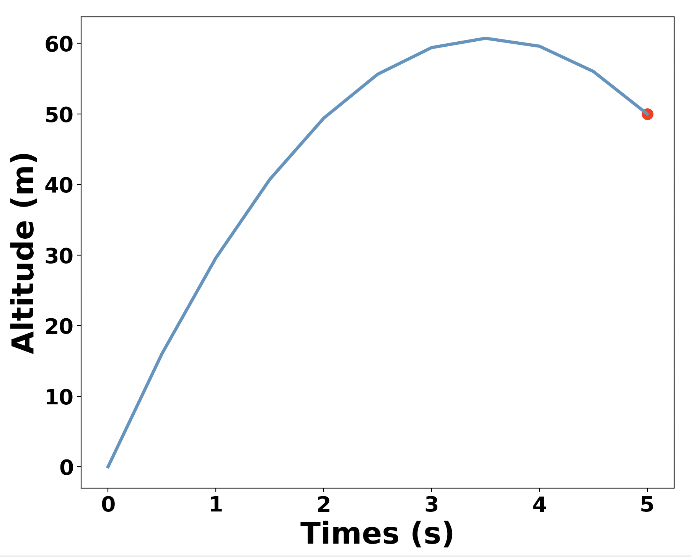

<!--
 * @Author: Uper 41718895+Hyliu-BUAA@users.noreply.github.com
 * @Date: 2022-06-30 18:08:07
 * @LastEditors: Uper 41718895+Hyliu-BUAA@users.noreply.github.com
 * @LastEditTime: 2022-06-30 23:53:52
 * @FilePath: /Quantum_Mechanics/CodeForQM/1.解薛定谔方程/notes/2.有限差分法解偏微分方程.md
 * @Description: 这是默认设置,请设置`customMade`, 打开koroFileHeader查看配置 进行设置: https://github.com/OBKoro1/koro1FileHeader/wiki/%E9%85%8D%E7%BD%AE
-->
# 有限差分法 (`FDM`) 解常微分方程 (`ODE`)

学习网址
------
https://pythonnumericalmethods.berkeley.edu/notebooks/chapter23.03-Finite-Difference-Method.html

# 1. Finite Difference Method
1. A way to solve the `ODE boundary value problem` is `finite difference method`, where we can <font color="73DB90" size="4">use finite difference formulas at spaced grid points to approximate the differenial equation.</font>This way, we can <font color="steelblue" size="4">transform a `differential equation` into `a system of algebraic equation to solve`.</font>
2. In the finite difference method, <font color="73DB90" size="4">the `derivatives` in the differential equation are approximated using the `finite difference formulas`.</font> We can divide the the `interval` of $[a,b]$ into $n$ equal subintervals of `length` $h$ as shown in the following figure.

3. Commonly, we usually use the <font color="73DB90" size="4">`central difference formulas` in the finite difference methods</font> due to the fact that they yield better accuracy. The differential equation is enforced only at the grid points, and `the first and second derivatives` are:
$$\begin{cases}
\frac{dy}{dx} = \frac{y_{i+1}-y_{i-1}}{2h}  \\ \\
\frac{d^2 y}{dx^2} = \frac{y_{i-1}-2y_i+y_{i+1}}{h^2}
\end{cases}$$
4. These <font color="73DB90" size="4">finite difference expressions are used to `replace the derivatives` of $y$ in the differential equation which leads to a system of $n+1$ linear algebraic equations</font> if the differential equation is linear. <font color="red" size="4">If the differential equation is nonlinear, the algebraic equations will also be nonlinear.</font>


# 2. Demo 1
## 2.1. Question
1. Solve the rocket problem in the previous section using the finite difference method, plot the altitude of the rocket after launching. The ODE is
$$\frac{d^2y}{dx^2}=-g$$

2. with the boundary conditions:
$$\begin{cases}
y(0) = 0 \\
y(5) = 50
\end{cases}$$
3. Let’s take $n=10$.

## 2.2. 思路
1. Since the time interval is $[0, 5]$ and we have `n=10`, therefore, `h=0.5`, using the finite difference approximated derivatives, we have
$$\begin{cases}
y_0 &= 0    \\
y_{i-1} - 2y_i + y_{i+1} &= -gh^2, \quad i=1,2,...,(n-1)   \\
y_{10} &= 50
\end{cases}$$
2. If we use matrix notation, we will have:
$$\begin{bmatrix}
1  &  0  &     &   &  \\
1  & -2  &  1  &   &  \\
   & \ddots & \ddots & \ddots & \\
   &     &  1  & -2 & 1 \\
   &     &     &    & 1
\end{bmatrix}
\begin{bmatrix}
y_0\\
y_1\\
\vdots\\
y_{n-1}\\
y_{n}
\end{bmatrix}
=
\begin{bmatrix}
0\\
-gh^2\\
\vdots\\
-gh^2\\
50
\end{bmatrix}$$

## 2.3. Code and Output
```python
import numpy as np
import matplotlib.pyplot as plt


n = 10      # The number of spaced subintervals
h = (5 - 0) / 10    # The length of subintervals

# 1. Get matrix A
A = np.zeros( (n+1, n+1) )  # 10 subintervals -> 11 points
A[0, 0] = 1
A[n, n] = 1
for i in range(1, n):
    A[i, i-1] = 1
    A[i, i] = -2
    A[i, i+1] = 1
print(A)


# 2. Get b -- row vector
b = np.zeros(n+1)
b[1:-1] = -9.8 * pow(h, 2)
b[-1] = 50
print(b)


# 3. solve the linear equations
y_lst = np.linalg.solve(A, b)


# 4. plot the picture
x_lst = np.linspace(0, 5, 11)

plt.figure(figsize=(10, 8))
plt.plot(x_lst, y_lst, 
        color="steelblue",
        linewidth=3)
plt.scatter(5, 50, s=100, c="red")
## 4.1. Retouch the xlabel, ylabel
plt.xlabel("Times (s)", 
            fontsize=28, 
            fontweight="bold"
)
plt.ylabel("Altitude (m)", 
            fontsize=28, 
            fontweight="bold"
)
# 4.2. Retouch the ticks of x-axis/y-axis
plt.xticks(fontsize=20, 
        fontweight="bold"
        )
plt.yticks(fontsize=20, 
        fontweight="bold"
        )
plt.show()
```
Output:
```shell
[[ 1.  0.  0.  0.  0.  0.  0.  0.  0.  0.  0.]
 [ 1. -2.  1.  0.  0.  0.  0.  0.  0.  0.  0.]
 [ 0.  1. -2.  1.  0.  0.  0.  0.  0.  0.  0.]
 [ 0.  0.  1. -2.  1.  0.  0.  0.  0.  0.  0.]
 [ 0.  0.  0.  1. -2.  1.  0.  0.  0.  0.  0.]
 [ 0.  0.  0.  0.  1. -2.  1.  0.  0.  0.  0.]
 [ 0.  0.  0.  0.  0.  1. -2.  1.  0.  0.  0.]
 [ 0.  0.  0.  0.  0.  0.  1. -2.  1.  0.  0.]
 [ 0.  0.  0.  0.  0.  0.  0.  1. -2.  1.  0.]
 [ 0.  0.  0.  0.  0.  0.  0.  0.  1. -2.  1.]
 [ 0.  0.  0.  0.  0.  0.  0.  0.  0.  0.  1.]]
[ 0.   -2.45 -2.45 -2.45 -2.45 -2.45 -2.45 -2.45 -2.45 -2.45 50.  ]
```
