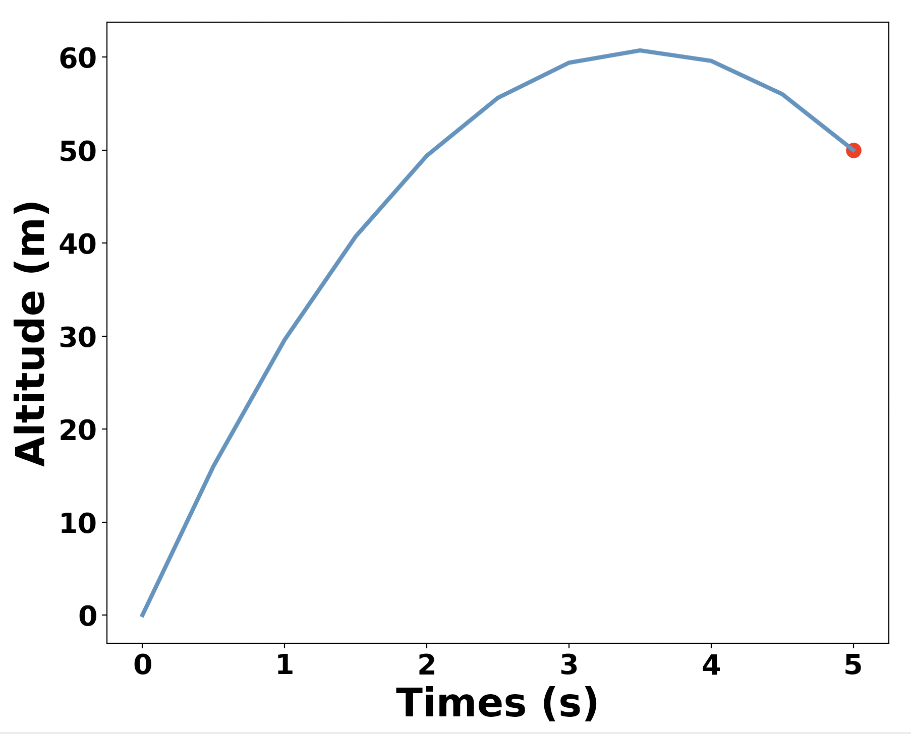
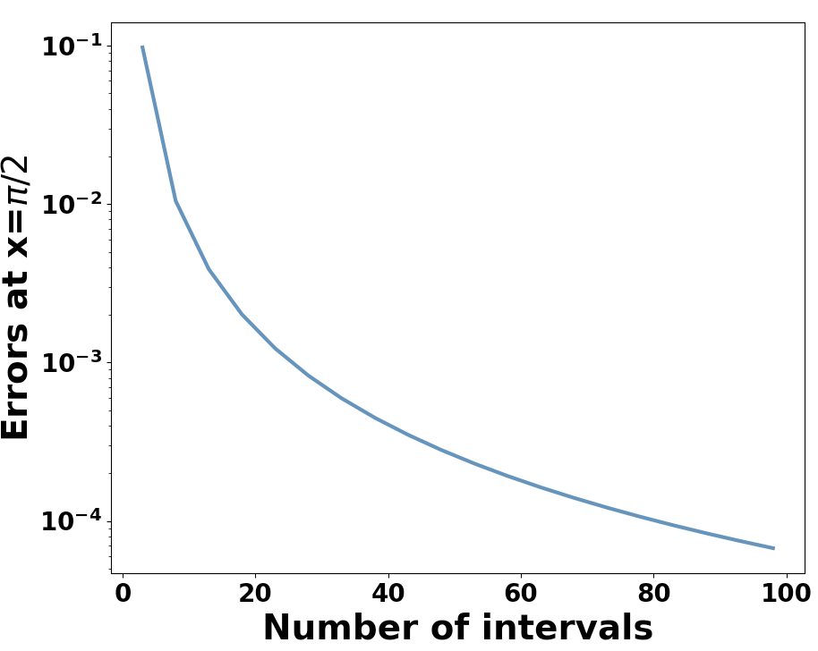

<!--
 * @Author: Uper 41718895+Hyliu-BUAA@users.noreply.github.com
 * @Date: 2022-06-30 18:08:07
 * @LastEditors: Uper 41718895+Hyliu-BUAA@users.noreply.github.com
 * @LastEditTime: 2022-07-01 17:59:53
 * @FilePath: /Quantum_Mechanics/CodeForQM/1.解薛定谔方程/notes/2.有限差分法解偏微分方程.md
 * @Description: 这是默认设置,请设置`customMade`, 打开koroFileHeader查看配置 进行设置: https://github.com/OBKoro1/koro1FileHeader/wiki/%E9%85%8D%E7%BD%AE
-->
# 有限差分法 (`FDM`) 解常微分方程 (`ODE`)

学习网址
------
https://pythonnumericalmethods.berkeley.edu/notebooks/chapter23.03-Finite-Difference-Method.html

# 1. Finite Difference Method
1. A way to solve the `ODE boundary value problem` is `finite difference method`, where we can <font color="73DB90" size="4">use finite difference formulas at spaced grid points to approximate the differenial equation.</font>This way, we can <font color="steelblue" size="4">transform a `differential equation` into `a system of algebraic equation to solve`.</font>
2. In the finite difference method, <font color="73DB90" size="4">the `derivatives` in the differential equation are approximated using the `finite difference formulas`.</font> We can divide the the `interval` of $[a,b]$ into $n$ equal subintervals of `length` $h$ as shown in the following figure.

3. Commonly, we usually use the <font color="73DB90" size="4">`central difference formulas` in the finite difference methods</font> due to the fact that they yield better accuracy. The differential equation is enforced only at the grid points, and `the first and second derivatives` are:
$$\begin{cases}
\frac{dy}{dx} = \frac{y_{i+1}-y_{i-1}}{2h}  \\ \\
\frac{d^2 y}{dx^2} = \frac{y_{i-1}-2y_i+y_{i+1}}{h^2}
\end{cases}$$
4. These <font color="73DB90" size="4">finite difference expressions are used to `replace the derivatives` of $y$ in the differential equation which leads to a system of $n+1$ linear algebraic equations</font> if the differential equation is linear. <font color="red" size="4">If the differential equation is nonlinear, the algebraic equations will also be nonlinear.</font>


# 2. Demo 1：自由落体问题
## 2.1. Question
1. Solve the rocket problem in the previous section using the finite difference method, plot the altitude of the rocket after launching. The ODE is
$$\frac{d^2y}{dx^2}=-g$$

2. with the boundary conditions:
$$\begin{cases}
y(0) = 0 \\
y(5) = 50
\end{cases}$$
3. Let’s take $n=10$.

## 2.2. 思路
<font color="steelblue" size="4">

1. Since the time interval is $[0, 5]$ and we have `n=10`, therefore, `h=0.5`, using the finite difference approximated derivatives, we have
$$\begin{cases}
y_0 &= 0    \\
y_{i-1} - 2y_i + y_{i+1} &= -gh^2, \quad i=1,2,...,(n-1)   \\
y_{10} &= 50
\end{cases}$$
2. If we use matrix notation, we will have:
$$\begin{bmatrix}
1  &  0  &     &   &  \\
1  & -2  &  1  &   &  \\
   & \ddots & \ddots & \ddots & \\
   &     &  1  & -2 & 1 \\
   &     &     &    & 1
\end{bmatrix}
\begin{bmatrix}
y_0\\
y_1\\
\vdots\\
y_{n-1}\\
y_{n}
\end{bmatrix}
=
\begin{bmatrix}
0\\
-gh^2\\
\vdots\\
-gh^2\\
50
\end{bmatrix}$$

`Vectorize`
-----------
1. 向量化:
$\begin{aligned}
\begin{bmatrix}
-2 & 0 & 0 & 0 & \cdots & 0 & 0 & 0 \\
1 & -2 & 1 & 0 & \cdots & 0 & 0 & 0 \\
0 & 1 & -2 & 1 & \cdots & 0 & 0 & 0 \\
\vdots & \vdots & \vdots & \vdots & \ddots & \vdots & \vdots & \vdots \\
0 & 0 & 0 & 0 & \cdots & 1 & -2 & 1\\
0 & 0 & 0 & 0 & \cdots & 0 & 1 & -2 
\end{bmatrix}_{N*N}
\begin{bmatrix}
f(x_1)  \\
f(x_2)  \\
f(x_3)  \\
\vdots  \\
f(x_{N-1}) \\
f(x_{N})
\end{bmatrix}_{N*1}
=
\begin{bmatrix}
-2f(x_1) \\
f(x_1) + f(x_3) - 2f(x_2) \\
f(x_2) + f(x_4) - 2f(x_3) \\
\cdots \\
f(x_{N-2}) + f(x_{N}) - 2f(x_{N-1}) \\
f(x_{N-1}) - 2f(x_{N}) \\
\end{bmatrix}
\end{aligned}$
2. 上式中，只有 $(N-2)$ 个方程，因此我们需要在开头和结尾添加`边界条件`。

</font>

## 2.3. Code and Output
```python
import numpy as np
import matplotlib.pyplot as plt


n = 10      # The number of spaced subintervals
h = (5 - 0) / 10    # The length of subintervals

# 1. Get matrix A
A = np.zeros( (n+1, n+1) )  # 10 subintervals -> 11 points
A[0, 0] = 1
A[n, n] = 1
for i in range(1, n):
    A[i, i-1] = 1
    A[i, i] = -2
    A[i, i+1] = 1
print(A)


# 2. Get b -- row vector
b = np.zeros(n+1)
b[1:-1] = -9.8 * pow(h, 2)
b[-1] = 50
print(b)


# 3. solve the linear equations
y_lst = np.linalg.solve(A, b)


# 4. plot the picture
x_lst = np.linspace(0, 5, 11)

plt.figure(figsize=(10, 8))
plt.plot(x_lst, y_lst, 
        color="steelblue",
        linewidth=3)
plt.scatter(5, 50, s=100, c="red")
## 4.1. Retouch the xlabel, ylabel
plt.xlabel("Times (s)", 
            fontsize=28, 
            fontweight="bold"
)
plt.ylabel("Altitude (m)", 
            fontsize=28, 
            fontweight="bold"
)
# 4.2. Retouch the ticks of x-axis/y-axis
plt.xticks(fontsize=20, 
        fontweight="bold"
        )
plt.yticks(fontsize=20, 
        fontweight="bold"
        )
plt.show()
```
Output:
```shell
[[ 1.  0.  0.  0.  0.  0.  0.  0.  0.  0.  0.]
 [ 1. -2.  1.  0.  0.  0.  0.  0.  0.  0.  0.]
 [ 0.  1. -2.  1.  0.  0.  0.  0.  0.  0.  0.]
 [ 0.  0.  1. -2.  1.  0.  0.  0.  0.  0.  0.]
 [ 0.  0.  0.  1. -2.  1.  0.  0.  0.  0.  0.]
 [ 0.  0.  0.  0.  1. -2.  1.  0.  0.  0.  0.]
 [ 0.  0.  0.  0.  0.  1. -2.  1.  0.  0.  0.]
 [ 0.  0.  0.  0.  0.  0.  1. -2.  1.  0.  0.]
 [ 0.  0.  0.  0.  0.  0.  0.  1. -2.  1.  0.]
 [ 0.  0.  0.  0.  0.  0.  0.  0.  1. -2.  1.]
 [ 0.  0.  0.  0.  0.  0.  0.  0.  0.  0.  1.]]
[ 0.   -2.45 -2.45 -2.45 -2.45 -2.45 -2.45 -2.45 -2.45 -2.45 50.  ]
```



# 3. High order `Centeral Finite Method` formula
## 3.1. $f(x)$ 的变化量用 $\delta_h^n[f](x)$ 表示

### 3.1.1. formula
$$\delta_h^n[f]x) = \sum_{i=0}^n(-1)^i\begin{pmatrix}n\\i\end{pmatrix}f[x+(\frac{n}{2}-i)h]$$

### 3.1.2. 变量含义
1. $n$：导数的次数
2. $h$：自变量 $x$ 的变化量
3. $f$：函数
4. $x$：表示 $x$ 处的变化量
5. $\begin{pmatrix}n \\ i\end{pmatrix}$：二项式系数

### 3.1.3. Biomial coefficient (二项式系数)
$$\begin{pmatrix}n \\ i\end{pmatrix} = \frac{n!}{k!(n-k)!}$$

### 3.1.4. <font color="73DB90" size="4"><b>Higher-order ODE (高阶常微分方程)</b></font>
1. <font color="red" size="4">The `finite difference method` can be also applied to `higher-order ODEs`, but it needs approximation of the `higher-order derivatives` using the finite difference formula. For example, if we are solving `a fourth-order ODE`, we will need to use the following:</font>
$$\frac{d^4y}{dx^4}=\frac{y_{i-2}-4y_{i-1}+6y_i-4y_{i+1}+y_{i+2}}{h^4}$$
2. <font color="red" size="4">We won’t talk more on the higher-order ODEs, since the idea behind to solve `it is similar to the second-order ODE` we discussed above.</font>


# 4. Demo 2: $f''(x) = -4f(x) + 4x$ (`linear boundary value problem`)
## 4.1. Question
1. The `ODE` is:
$$f''(x)=-4f(x)+4x$$
2. Boundary conditions:
$$\begin{cases}
f(0) &= 0\\
f'(\frac{\pi}{2}) &= 0
\end{cases}$$
3. The exact solution of the problem is $y=x−\sin{2x}$, plot the errors against the $n$ grid points ($n$ from 3 to 100) for the boundary point $y(\frac{\pi}{2})$.

## 4.2. 思路
1. With `finite difference method`, we can get:
$$\begin{cases}
y_0 &= 0        \\
y_{i-1} + (4h^2-2)y_i + y_{i+1} &= 4h^2x_i, \quad i=1, 2, 3, ..., (n-1)  \\
2y_{i-1} + (4h^2-2)f(x_n) &= 4h^2x_n
\end{cases}$$

2. Transform to matrix notetion:
$$\begin{bmatrix}
1   &   0   &   &   &   \\
1   &  4h^2-2 & 1 &   &   \\
    &  \ddots & \ddots & \ddots & \\
    &       & 1 & 4h^2-2 & 1    \\
    &       &   &  2 & 4h^2-2 
\end{bmatrix}
\begin{bmatrix}
y_0     \\
y_1     \\
\vdots  \\
y_{n-1} \\
y_{n}   \\
\end{bmatrix}
=
\begin{bmatrix}
0     \\
4h^2x_1     \\
\vdots  \\
4h^2x_{n-1} \\
4h^2x_{n}   \\
\end{bmatrix}
$$


## 4.3. Code and Output
```python
import numpy as np
import matplotlib.pyplot as plt


# 1. Get matrix A and b
def get_A_b(num_intervals:int):
    h = (np.pi/2 - 0) / num_intervals     # The length of subintervals
    x_lst = np.linspace(0, np.pi/2, num_intervals+1)
    
    ## 1.1. Get A
    A = np.zeros((num_intervals+1, num_intervals+1))
    A[0, 0] = 1
    A[num_intervals, num_intervals-1] = 2
    A[num_intervals, num_intervals] = 4 * pow(h, 2) - 2
    for i in range(1, num_intervals):
        A[i, i-1] = 1
        A[i, i] = 4 * pow(h, 2) - 2 
        A[i, i+1] = 1
    
    ## 1.2. Get b
    b = np.zeros(num_intervals + 1)
    for i in range(1, num_intervals+1):
        b[i] = 4 * pow(h, 2) * x_lst[i]
    
    return A, b


# 2. value calculated by Analytic solution
x_target = np.pi / 2    # 计算解析解 f(x) 在 x_target 处的值
func_value_analytic = x_target - np.sin(2*x_target)


# 3. 
ns_lst = []
errors_lst = []
for n_value in range(3, 100, 5):
    A, b = get_A_b(n_value)
    y = np.linalg.solve(A, b)
    
    ns_lst.append(n_value)
    errors_lst.append(func_value_analytic - y[-1])


# 4. plot the picture
x_lst = np.linspace(0, 5, 11)

plt.figure(figsize=(10, 8))
plt.plot(ns_lst, errors_lst, 
        color="steelblue",
        linewidth=3)
plt.yscale('log')   # 纵坐标变成指数坐标

## 4.1. Retouch the xlabel, ylabel
plt.xlabel("Number of intervals", 
            fontsize=28, 
            fontweight="bold"
)
plt.ylabel("Errors at x=$\pi/2$", 
            fontsize=28, 
            fontweight="bold"
)
# 4.2. Retouch the ticks of x-axis/y-axis
plt.xticks(fontsize=20, 
        fontweight="bold"
        )
plt.yticks(fontsize=20, 
        fontweight="bold"
        )
plt.show()
```
Output:
