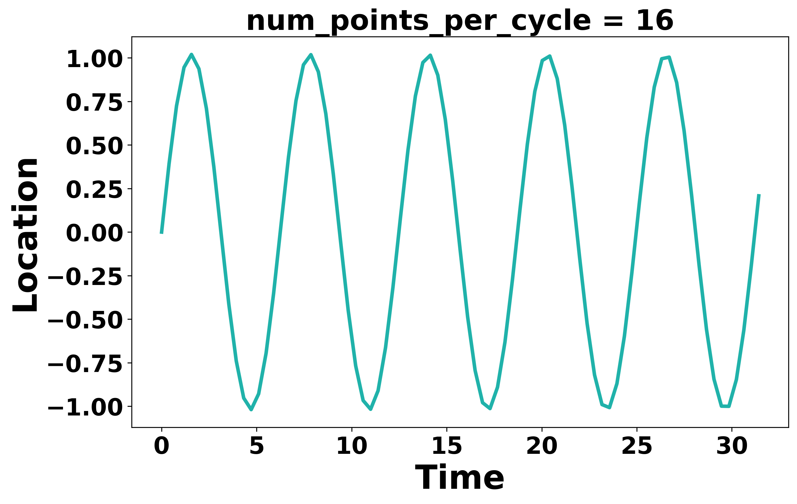
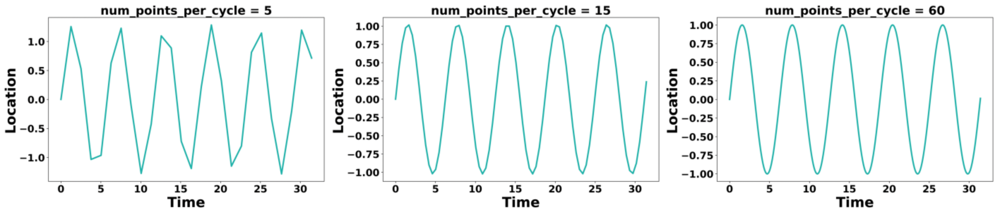

<!--
 * @Author: Uper 41718895+Hyliu-BUAA@users.noreply.github.com
 * @Date: 2022-06-25 18:48:55
 * @LastEditors: Uper 41718895+Hyliu-BUAA@users.noreply.github.com
 * @LastEditTime: 2022-06-28 00:26:41
 * @FilePath: /Quantum_Mechanics/algorithm_implementation/3.Leapfrog/notes/Leapfrog.md
 * @Description: 这是默认设置,请设置`customMade`, 打开koroFileHeader查看配置 进行设置: https://github.com/OBKoro1/koro1FileHeader/wiki/%E9%85%8D%E7%BD%AE
-->
学习网站
-------
https://www.compphy.com/leap-frog/


# 1. `Leap-frog` algorithm (also called `Leap-frog` integration)

<font color="73DB90" size="4">

1. In molecule dynamics, we usually use `leap-frog` algorithm to achieve the aim -- (`a` -> `v` -> `x`).
    - In MD, we have a `potential function` to calculate `forces` (`a`).
2. `Leap-frog` algorithm has less error at large time steps.

</font>

## 1.1. 图示

note: $t_0$ 处初始化，得到 $v_0$, $x_0$，先算 $x_1$, 再算 $v_{1.5}$

## 1.2. 公式
1. 初始化：
$$\begin{cases}
x(t_0)=x_0, \quad a(t_0)=a_0  \\
v(t_{0.5})=v_0
\end{cases}$$
2. Leap-frog 过程：
$$\begin{cases}
x(t+\Delta t) = x(t) + v(t+\frac{\Delta}{2})\Delta t    \\
根据位置计算 \quad a(t+\Delta t)\\
v(t+\frac{3\Delta t}{2}) = v(t+\frac{\Delta t}{2}) + a(t+\Delta t)\Delta t
\end{cases}$$

<font color="red" size="4">

Note
----
1. The `positions` and `accelerations (forces)` will always be `at full time step`.
2. The `velocities` will always be `at half time step`.

</font>


## 2. Demo 1: 绘制出 $x^{''} + x = 0$ 的运动轨迹
### 2.1. 计算轨迹并输出 (C++ 实现)
```c++
#include <fstream>
#include <vector>
#include <string>
#include <cmath>


class LeapFrog {
private:
    std::vector<double> LocationsLst;       // 存储 full-step 的位置
    std::vector<double> AccelerationsLst;   // 存储 full-step 的加速度
    std::vector<double> VelocitiesLst;      // 存储 half-step 的速度
    double DeltaT;                          // 时间步长
    double TotalT;                          // 总模拟时间
    int NumSteps;                           // 总模拟步数 = 总模拟时间 / 时间步长
    std::ofstream FileCout;     


public:
    LeapFrog(double location_origin,
            double velocity_origin,
            double deltaT,
            double totalT,
            std::string output_path) {
        /*
        Description
        -----------
            1. Constructor function
        */
        LocationsLst.push_back(location_origin);       // 初始化 full-step 处的 `位置`
        double acceleration_origin = CalculateAcceleration(location_origin);
        AccelerationsLst.push_back(acceleration_origin);   // 初始化 full-step 处的 `加速度`
        VelocitiesLst.push_back(velocity_origin);      // 初始化 half-step 处的 `速度`

        DeltaT = deltaT;    // 初始化时间步长
        TotalT = totalT;    // 初始化总模拟时长
        NumSteps = TotalT / DeltaT; // 初始化总模拟步数

        FileCout.open(output_path);
    }


    double CalculateAcceleration(double location) {
        /*
        Description
        -----------
            1. 已知 `加速度` 与 `位移` 的关系为： x'' + x = 0
        */
        return (-location);
    }


    double CalculateTime(int idx_step) {
        /*
        Description
        -----------
            1. 根据 idx_step 计算当前时间
        */
        return idx_step * DeltaT;
    }


    void WalkFullStep(int idx_step) {
        /*
        Description
        -----------
            1. 计算下一个 full-step 的 `位置` 和 `加速度`
        */
        double new_location = LocationsLst[idx_step-1] + DeltaT * VelocitiesLst[idx_step-1];
        LocationsLst.push_back(new_location);
        double new_acceleration = CalculateAcceleration(new_location);
        AccelerationsLst.push_back(new_acceleration);
    }


    void WalkHalfStep(int idx_step) {
        /*
        Description
        -----------
            1. 计算下一个 half-step 的 `速度`
        */
       double new_velocity = VelocitiesLst[idx_step-1] + DeltaT * AccelerationsLst[idx_step];
       VelocitiesLst.push_back(new_velocity);
    }


    void run() {
        // 输出格式：时间、加速度、速度、位置
        FileCout << 0 << ',' 
                << LocationsLst[0] << std::endl;

        for (int i=1; i < NumSteps + 1; i++) {
            WalkFullStep(i);
            WalkHalfStep(i);

            // 输出
            double timeNow = CalculateTime(i);
            FileCout << timeNow << ',' 
                    << LocationsLst[i] << std::endl;
        }
    }
};


int main() {
    double location_origin = 0;
    double velocity_origin = 1;

    double num_cycles = 5;   // 模拟周期的个数
    double totalT = num_cycles * 2 * M_PI;   // 模拟总时长 = 模拟周期的个数 * 周期长度

    double num_points_per_cycle = 16;   // 每个周期内取点个数
    double deltaT = 2 * M_PI / num_points_per_cycle;    // 时间步长 = 周期长度 / 周期内取点个数

    std::string output_path = "./output.csv";


    LeapFrog leap_frog(location_origin, velocity_origin, deltaT, totalT, output_path);
    leap_frog.run();

    return 0;
}
```

### 3.1.2. 绘制轨迹
```python
import pandas as pd
import matplotlib.pyplot as plt


plt.figure(figsize=(10, 6))

df = pd.read_csv("./output.csv",
                header=None)
df.columns = ["Time", "Location"]
plt.plot(df.loc[:, "Time"],
        df.loc[:, "Location"],
        color="lightseagreen",
        linewidth=3)


# 1. Retouch the xlabel, ylabel
plt.xlabel("Time", 
            fontsize=28, 
            fontweight="bold"
)
plt.ylabel("Location", 
            fontsize=28, 
            fontweight="bold"
)

# 2. Retouch the ticks of x-axis/y-axis
plt.xticks(fontsize=20, 
        fontweight="bold"
        )
plt.yticks(fontsize=20, 
        fontweight="bold"
        )

# 3. title
plt.title("num_points_per_cycle = 16",
        fontsize=24,
        fontweight="bold")


# Save the figure
plt.savefig("./Locations_16.png", dpi=300, bbox_inches="tight")
```
Output:


### 3.1.3. 时间步长对蛙跳算法效果的影响
在上述代码中，我们通过控制 `num_points_per_cycles (每个周期内原子数目)` 控制时间步长的大小。接下来，我们分别设置 `num_points_per_cycles` = `5`, `15`, `60`，观察轨迹的变化 。


我们可以看出，时间步长取的越小 (每个周期取点越多)，蛙跳算法描述的轨迹越接近真实的运动轨迹。但是由于在真正的分子动力学模拟中，每一步所需的计算成本较大，不可以盲目取小的时间步长，需要每个人根据自己的研究体系具体地分析。