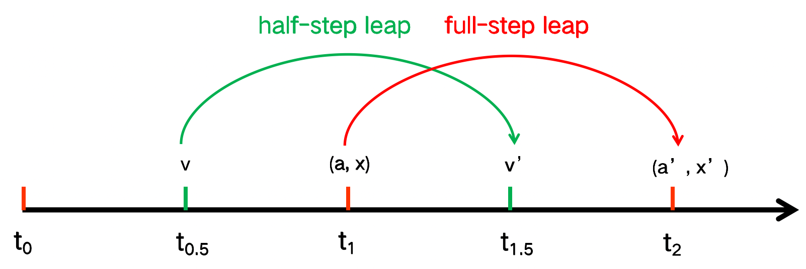
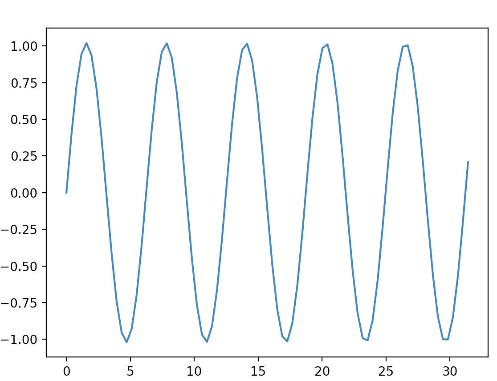

<!--
 * @Author: Uper 41718895+Hyliu-BUAA@users.noreply.github.com
 * @Date: 2022-06-25 18:48:55
 * @LastEditors: Uper 41718895+Hyliu-BUAA@users.noreply.github.com
 * @LastEditTime: 2022-06-26 00:36:12
 * @FilePath: /Quantum_Mechanics/algorithm_implementation/3.Leapfrog/notes/Leapfrog.md
 * @Description: 这是默认设置,请设置`customMade`, 打开koroFileHeader查看配置 进行设置: https://github.com/OBKoro1/koro1FileHeader/wiki/%E9%85%8D%E7%BD%AE
-->
学习网站
-------
https://www.compphy.com/leap-frog/


# 1. `Leap-frog` algorithm (also called `Leap-frog` integration)

<font color="73DB90" size="4">

1. In molecule dynamics, we usually use `leap-frog` algorithm to achieve the aim -- (`a` -> `v` -> `x`).
    - In MD, we have a `potential function` to calculate `forces` (`a`).
2. `Leap-frog` algorithm has less error at large time steps.

</font>

## 1.1. 图示

note: $t_0$ 处初始化，得到 $v_0$, $x_0$，先算 $x_1$, 再算 $v_{1.5}$

## 1.2. 公式
$$\begin{cases}
x(t+\Delta t) = x(t) + v(t+\frac{\Delta}{2})\Delta t    \\
v(t+\frac{\Delta t}{2}) = v(t-\frac{\Delta t}{2}) + a(t)\Delta t
\end{cases}$$

<font color="red" size="4">

Note
----
1. The `positions` and `accelerations (forces)` will always be `at full time step`.
2. The `velocities` will always be `at half time step`.

</font>


# 2. Demo: 绘制出 $x^{''} + x = 0$ 的运动轨迹
```python
import numpy as np
import matplotlib.pyplot as plt

# Solve x" = f(x) using leapfrog integrator

# For this demo, x'' + x = 0
# Exact solution is x(t) = sin(t)
def f(x):
    return -x

num_cycles = 5                          # number of periods
num_points_per_cyle = 16                # number of time steps per period
h = 2*np.pi / num_points_per_cyle       # step size

x = np.empty( num_cycles * num_points_per_cyle + 1 )    # positions
v = np.empty( num_cycles * num_points_per_cyle + 1 )    # velocities

# Initial conditions
# Note: you should set the origin x and origin v carefully (according to `sin(x)` here)
x[0] = 0
v[0] = 1
a_new = f(x[0])

# leapfrog method
for i in range(1, num_cycles * num_points_per_cyle + 1):
    a_old = a_new
    x[i] = x[i-1] + v[i-1] * h + 0.5*a_old*h**2     # 修正了位移 x 的计算公式
    a_new = f(x[i])
    v[i] = v[i-1] + 0.5 * (a_new + a_old) * h       # 修正了速度 v 的计算公式

t = np.linspace(0, 2*np.pi*num_cycles, num_cycles * num_points_per_cyle + 1)
plt.plot(t, x)
plt.show()
```
output:



## 3. Demo 3:
```python
import numpy as np
import matplotlib.pyplot as plt

# Solve x" = f(x) using leapfrog integrator

# For this demo, x'' + x = 0
# Exact solution is x(t) = sin(t)
def f(x):
    return -x

num_cycles = 5                          # number of periods
num_points_per_cyle = 16                # number of time steps per period
h = 2*np.pi / num_points_per_cyle       # step size

x = np.empty( num_cycles * num_points_per_cyle + 1 )    # positions
v = np.empty( num_cycles * num_points_per_cyle + 1 )    # velocities

# Initial conditions
# Note: you should set the origin x and origin v carefully (according to `sin(x)` here)
x[0] = 0
v[0] = 1
a_new = f(x[0])

# leapfrog method
for i in range(1, num_cycles * num_points_per_cyle + 1):
    x[i] = x[i-1] + v[i-1] * h     
    a_new = f(x[i])
    v[i] = v[i-1] + a_new * h

t = np.linspace(0, 2*np.pi*num_cycles, num_cycles * num_points_per_cyle + 1)
plt.plot(t, x)
plt.show()
```