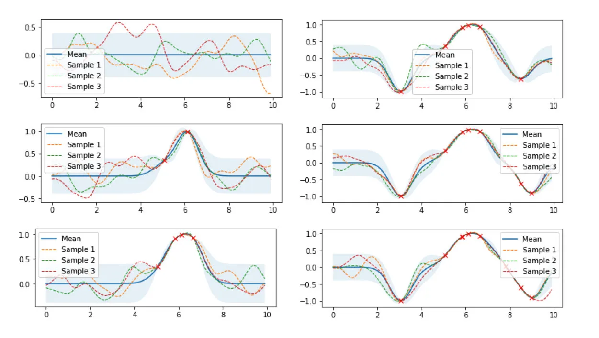
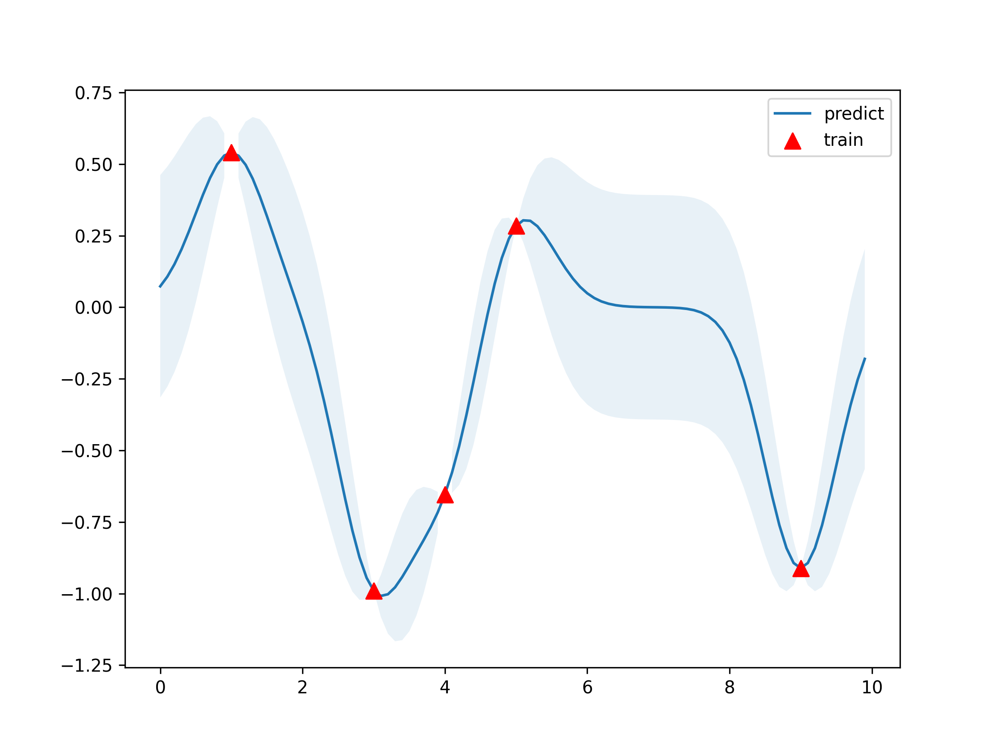

# 0. Introduction
<font color="#73db90" size="4">

Website
-------
https://zhuanlan.zhihu.com/p/75589452

Content
-------
1. `Gaussian Process` 是概率论和数理统计中`随机过程`的一种，是多元高斯分布的扩展，被应用于机器学习、信号处理等领域。
2. 本文对 `Gaussian Process` 进行公式推导、原理阐述、可视化、代码实现
3. 介绍了以 `Gaussian Process` 为基础的 `Gaussian Process Regression` 基本原理、超参数优化、高维输入

Category
--------
1. 一元高斯分布
2. 多元高斯分布
3. 无限元高斯分布
4. 核函数（协方差函数）
5. 高斯过程可视化
6. 高斯过程回归实现
7. 超参数优化
8. 多维输入
9. 高斯过程回归的优缺点

</font>

# 1. 一元高斯分布
<font color="steelblue" size="4">

1. `一元高斯分布`的`概率密度函数`为
    - $\mu$ 表示`均值`，$\sigma$ 表示`方差`
    - $\mu$ 和 $\sigma$ 决定了曲线的形状
$\begin{aligned}
p(x) = \frac{1}{\sigma \sqrt{2\pi}}\exp{(-\frac{(x-\mu)^2}{2\sigma^2})}
\end{aligned}$

</font>

# 2. 多元高斯分布
<font color="steelblue" size="4">

1. 从`一元高斯分布`推广到`多元高斯分布`，`假设各个维度之间是独立的`
$\begin{aligned}
p(x_1, x_2, ..., x_n) &= \prod_{i=1}^n {p(x_i)} \\
&= \frac{1}{ (2\pi)^{\frac{n}{2}}\sigma_1 \sigma_2...\sigma_n } \exp{(-\frac{1}{2} \left[ \frac{(x_1-\mu_1)^2}{\sigma_1^2} + \frac{(x_2-\mu_2)^2}{\sigma_2^2} + ..+ \frac{(x_n-\mu_n)^2}{\sigma_n^2}  \right])}
\end{aligned}$
    - $\mu_1, \mu_2, ...$ 表示第1维、第2维、...的均值
    - $\sigma_1, \sigma_2, ...$ 表示第1维、第2维、...的均值
2. 令
$\begin{aligned}
\vec{x} - \vec{\mu} &=
\begin{bmatrix}
x_1-\mu_1, & x_2-\mu_2, & ..., & x_n-\mu_n
\end{bmatrix} \\
K &= 
\begin{bmatrix}
\sigma_1^2 & 0 & \cdots & 0    \\
0 & \sigma_2^2 & \cdots & 0    \\
\vdots & \vdots & \ddots & \vdots \\
0 & 0 & 0 & \sigma_n^2
\end{bmatrix}
\end{aligned}$
3. 有
$\begin{aligned}
\sigma_1\sigma_2\cdots\sigma_n = |K|^{\frac{1}{2}}  \\
\frac{(x_1-\mu_1)^2}{\sigma_1^2} + \frac{(x_2-\mu_2)^2}{\sigma_2^2} + ... + \frac{(x_n-\mu_n)^2}{\sigma_n^2} = (\vec{x}-\vec{\mu})^TK^{-1}(\vec{x}-\vec{\mu})
\end{aligned}$
4. 所以`多元高斯分布`的`概率密度函数`为
$\begin{aligned}
p(x) = (2\pi)^{-\frac{n}{2}}|K|^{-\frac{1}{2}} \exp{\left(-\frac{1}{2}(\vec{x}-\vec{\mu})^T K^{-1} (\vec{x}-\vec{\mu}) \right)}
\end{aligned}$
   - $\vec{\mu} \in \mathbb{R^n}$ 是`均值向量`
   - $K \in \mathbb{R^{n*n}}$ 为`协方差矩阵`。<font color="red">由于我们`假设了各维度直接相互独立`，因此 $K$ 是一个`对角矩阵`。在各维度变量`相关时`，上式的形式仍然一致，但此时协方差矩阵 $K$ `不再是对角矩阵`，只具备半正定和对称的性质。</font>
   - 上式通常也简写为: $x \sim \mathcal{N}(\vec{\mu}, K)$

</font>


# 3. 无限元高斯分布
## 3.1. `高斯过程 (Gaussian Process)`的定义
<font color="steelblue" size="4">

1. 当从函数的视角去看待采样，理解了每次`采样无限维`相当于`采样一个函数`。原来的`概率密度函数`不再是`点的分布`，而变成了`函数的分布`。<font color="red">这个`无限维高斯分布`即称为`高斯过程 (Gaussian Process)`。</font>
2. 高斯过程的正式定义为：对于所有 $\vec{x} = \left[ x_1, x_2, ..., x_n \right]$, $f(x) = \left[ f(x_1), f(x_2), ..., f(x_n) \right]$ 都服从`多元高斯分布`，则称 $f$ 是一个高斯过程，表示为
$$ f(\vec{x}) = \mathcal{N}(\mu{(x)}, \mathcal{K}(\vec{x}, \vec{x})) $$
    - $\mu(\vec{x}) \in \mathbb{R^n}$，表示`均值函数 (Mean function)`，返回各个维度的均值
    - $\mathcal{K}(\vec{x}, \vec{x}) \in \mathbb{R^{n*n}}$，表示`协方差矩阵 (Covariance function)`，返回两个向量各个维度之间的协方差矩阵。
    - 一个 `高斯过程(Gaussian Process)` 被一个`均值函数`和`协方差函数`唯一定义。

</font>

## 3.2. 核函数 (协方差函数)
<font color="steelblue" size="4">

1. `核函数`是一个高斯过程的核心，核函数决定了一个高斯过程的性质。<font color="red">`核函数`生成一个`协方差矩阵 (相关系数矩阵)`来`衡量任意两点之间的距离`。</font>
    - 不同核函数有不同的衡量方法，得到的高斯过程的性质也不一样。
2. 最常用的核函数是`高斯核函数 (径向基函数, RBF)`:
$$ K(x_i, x_j) = \sigma^2\exp{(-\frac{|x_i-x_j|^2_2}{2l^2})} $$

</font>

## 3.3. `Gaussian kernel function` 的实现
```python
import numpy as np


def gaussian_kernel(x1:np.array,
                    x2:np.array,
                    l:float=1.0,
                    sigma_f=1.0):
    '''
    Note:
    ----
        1. x1, x2 都需要以列向量形式输入 (x1, x2 都是二维 np.array)
    '''
    dist_matrix = np.sum(np.power(x1, 2), 1).reshape(-1, 1) + \
                np.sum(np.power(x2, 2), 1).reshape(1, -1) - \
                2 * x1 * x2.T
    return np.power(sigma_f, 2) * np.exp(-0.5 * dist_matrix / np.power(l, 2))


if __name__ == "__main__":
    x = np.array([700, 800, 1029]).reshape(-1, 1)
    print(gaussian_kernel(x, x, l=500, sigma_f=10))
```
Output:
```shell
[[100.          98.01986733  80.5347031 ]
 [ 98.01986733 100.          90.04307671]
 [ 80.5347031   90.04307671 100.        ]]
```


# 4. `Gaussian Process` 可视化
## 4.1. `高斯过程回归` 的 `基本过程` 和 `基本公式`
<font color="steelblue" size="4">

1. 下图是`高斯过程的可视化`，其中蓝线是高斯过程的`均值`，浅蓝色区域 `95% 置信区间`（由协方差矩阵的对角线得到），每条虚线代表一个`函数采样`（这里用了 100 维模拟连续无限维）。左上角第一幅图是`高斯过程的先验`（这里用了零均值作为先验），后面几幅图展示了当观测到新的数据点的时候，高斯过程`如何更新自身的均值函数和协方差函数`。

2. 接下来我们用公式推导上述图片的过程。将高斯过程的先验表示为$f(\vec{x})\sim \mathcal{N}(\vec{\mu_f}, K_{ff})$，对应左上角第一幅图片，如果我们观测到一些数据$(\vec{x^{*}}, \vec{y^{*}})$，并且假设$\vec{y^{*}}$与$f(x)$ 服从`联合高斯分布`：
$\begin{aligned}
\begin{bmatrix}
f(x) \\
\vec{y^*}
\end{bmatrix} \sim
\mathcal{N}
(
\begin{bmatrix}
\vec{\mu_f} \\
\vec{\mu_y}
\end{bmatrix},
\begin{bmatrix}
K_{ff} & K_{fy} \\
K_{fy}^T & K_{yy}
\end{bmatrix}
)
\end{aligned}$
    - $K_{ff} = \mathcal{K}(\vec{x}, \vec{x})$
    - $K_{fy} = \mathcal{K}(\vec{x}, \vec{x^*})$
    - $K_{yy} = \mathcal{K}(\vec{x^*}, \vec{x^*})$
3. <font color="#73DB90">综上所述:
$\begin{aligned}
f \sim \mathcal{N}(K_{fy}^TK_{ff}^{-1}\vec{y} + \vec{\mu_f}, K_{yy}-K_{fy}^TK_{ff}^{-1}K_{fy})
\end{aligned}$
    - `均值`是`预测值`
    - `方差`是`置信区间`
</font>

4. 上述式子表明给定数据 $(\vec{x^*}, \vec{y^*})$ 之后函数的分布 $f$ 仍是一个高斯过程。这个式子可以看到一些有趣的性质：
    - `均值` $K_{fy}^TK_{ff}^{-1}\vec{y}+\vec{\mu_f}$ 实际上是观测点 $\vec{y}$ 的一个`线性函数`
    - `协方差项` $K_{yy}-K_{fy}^TK_{ff}^{-1}K_{fy}$ 的第一部分是我们先验的协方差，后面部分表示了观测到数据后函数分布不确定性的减少，如果第二项非常接近于 0，说明观测数据后我们的不确定性几乎不变，反之`如果第二项非常大`，则说明`不确定性降低了很多`。
5. `高斯过程回归的大致步骤`：
    1. 首先有一个高斯过程先验分布，观测到一些数据（机器学习中的训练数据）
    2. 基于先验和一定的假设（`联合高斯分布`）计算，`更新高斯过程`后验分布的`均值`和`协方差`。

</font>


## 4.2. `Gaussian Process Regression` 的实现
<font color="steelblue" size="4">

1. 考虑代码实现一个`高斯过程回归`，API 接口风格采用 `sciki-learn fit-predict` 风格。
2. 由于`高斯过程回归`是一种`非参数化 (non-parametric)`的模型
   1. `每次的 inference 都需要利用所有的训练数据进行计算得到结果`，因此并`没有一个显式的训练模型参数的过程`，所以 fit 方法只需要将训练数据保存下来，`实际的 inference 在 predict() 方法中进行`。

</font>

```python
import numpy as np 
import matplotlib.pyplot as plt


class GPR(object):
    def __init__(self, optimize:bool=True):
        self.is_fit = False
        self.X_train, self.y_train = None, None
        self.params = {'l': 0.5, 'sigma_f': 0.2}
        self.optimize = optimize
    
    
    def fit(self, X:np.array, y:np.array):
        '''
        Parameters
        ----------
            1. X: np.array (二维, 列向量形式)
            2. y: np.array (一维)
        '''
        self.is_fit = True
        self.X_train = X
        self.y_train = y

    
    def gaussian_kernel(self, x1:np.array, x2:np.array):
        '''
        Parameters
        ----------
            1. x1: np.array (二维, 列向量形式)
            2. x2: np.array (二维, 列向量形式)
        '''
        print((np.sum(np.power(x1, 2), 1).reshape(-1, 1) + np.sum(np.power(x2, 2), 1).reshape(1, -1)).shape)
        print((2 * x1.T * x2).shape)
        ### 注意下面这一句的写法
        dist_matrix = np.sum(np.power(x1, 2), 1).reshape(-1, 1) + \
                    np.sum(np.power(x2, 2), 1).reshape(1, -1) - \
                    2 * x1 * x2.T
        return np.power(self.params["sigma_f"], 2) * np.exp(-0.5 * dist_matrix / np.power(self.params["l"], 2))
    

    def predict(self, X:np.array):
        '''
        Parameters
        ----------
            1. X: np.array (二维, 列向量形式)
        '''
        if not self.is_fit:
            print("GPR Model not fit yet.")
            return None
        
        X = np.asarray(X)
        Kff = self.gaussian_kernel(self.X_train, self.X_train)  # (N, N)
        Kyy = self.gaussian_kernel(X, X)                        # (k, k)
        Kfy = self.gaussian_kernel(self.X_train, X)             # (N, k)
        Kff_inv = np.linalg.inv(Kff)

        mu = Kfy.T.dot(Kff_inv).dot(self.y_train)   # 矩阵的乘法
        cov = Kyy - Kfy.T.dot(Kff_inv).dot(Kfy)     # 矩阵的乘法
        
        return mu, cov
    

def get_y(x, noise_sigma=0.0):
    '''
    Parameters
    ----------
        1. x: np.array (二维, 列向量形式)

    Return 
    ------
        1. y.ravel(): np.array (一维)
    '''
    x = np.asarray(x)
    y = np.cos(x) + np.random.normal(0, noise_sigma, size=x.shape)
    return y.ravel()


def plot_gaussian_process(X_train:np.array,
                        y_train:np.array,
                        X_test:np.array,
                        y_test:np.array,
                        uncertainty:np.array):
    '''
    Parameters
    ----------
        1. X_train: np.array (二维，列向量形式)
        2. y_train: np.array (二维，列向量形式)
        3. X_test:  np.array (一维)
        4. y_test:  np.array (一维)
    '''
    X_train = X_train.ravel()
    y_train = y_train.ravel()
    X_test = X_test.ravel()
    y_test = y_test.ravel()
    uncertainty = uncertainty.ravel()

    plt.figure(figsize=(8, 6))
    plt.fill_between(X_test,
                    y_test+uncertainty,
                    y_test-uncertainty,
                    alpha=0.1)
    plt.plot(X_test,
            y_test,
            label="predict")
    plt.scatter(X_train,
                y_train,
                marker='^',
                color="red",
                s=80,
                zorder=2,
                label="train")
    plt.legend()

    plt.savefig(output_png_path, dpi=300)


if __name__ == "__main__":
    output_png_path = "/Users/mac/我的文件/Notebook/Quantum_Mechanics/algorithm_implementation/5.GaussianProcess/notes/pics/pic_2.png"

    X_train = np.array([3, 1, 4, 5, 9]).reshape(-1, 1)
    y_train = get_y(X_train, noise_sigma=0.0)
    X_test = np.arange(0, 10, 0.1).reshape(-1, 1)

    gpr = GPR()
    gpr.fit(X_train, y_train)
    mu, cov = gpr.predict(X_test)
    uncertainty = 1.96 * np.sqrt( np.diag(cov) )
    
    y_train = y_train.ravel()
    y_test = mu.ravel()

    # 绘图
    plot_gaussian_process(X_train=X_train,
                        y_train=y_train,
                        X_test=X_test,
                        y_test=y_test,
                        uncertainty=uncertainty)
```
Output:
