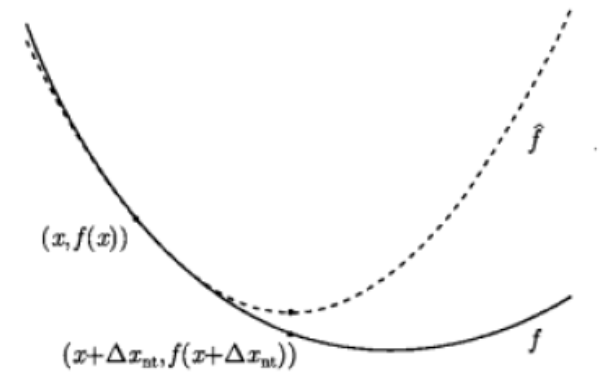

# 0. `Newton Method` (牛顿法)

# 1. `Newton Method` 的思想

1. 用`目标函数`的`二阶泰勒展开`近似该目标函数，通过求解这个`二次函数`的极小值来求解凸优化的`搜索方向 (牛顿步径)`。

# 2. `Newton Method` 的推导

1. 目标函数在 `x` 处的 Taylor展开为
$\begin{cases}
f(x+v) = f(x) + \nabla f(x)^Tv + \frac{1}{2}v^T\nabla^2f(x)v \\
v = \Delta x
\end{cases}$
2. 当 `x` 固定时，`v` 取多少可以使 `f(x+v)` 最小呢？可以考虑上式右边，其为 `v` 的函数
3. 使上边两边对 `v` 求导
$\begin{aligned}
\frac{\partial}{\partial v}f(x+v) = \nabla f(x) + \nabla^2f(x)v
\end{aligned}$
4. 当 `f(x)` 最小时，`f(x+v)` 对 `v` 的偏导为 `0`.
$\begin{aligned}
\nabla f(x) + \nabla^2 f(x)v = 0
\end{aligned}$
5. 则`搜索方向 (Newton 步径)` 为
$\begin{aligned}
\Delta x = v=-\nabla^2 f(x)^{-1}\nabla f(x)
\end{aligned}$
6. $\nabla^2 f(x)$ 是函数 $f(x)$ 的 `Hessian矩阵`，由`凸函数的Hessian矩阵`的`正定性`可知，除$f(x)$到达极值点($\nabla f(x)=0$)外，有
$\begin{aligned}
\nabla f(x)^T \Delta x_{nt} = -\nabla f(x)^T \nabla^2f(x)^{-1} \nabla f(x) < 0
\end{aligned}$
7. 因此 `Newton步径`是 `下降方向`
8. 下图中，实线是`目标函数`，虚线是`f(x)` 在 `x` 处的Taylor二阶展开

# 3. `Newton法`和`最速梯度下降法`的区别

1. 我们可以看出，`牛顿法` 和 `最速梯度下降法` 的不同在于：
2. `最速梯度下降法`的迭代方向是`梯度的负方向`，迭代步长根据一维搜索得到。
3. `牛顿法`的`迭代方向`为上述推导的`牛顿步径`，迭代步长可以看为定值1。如下：
$\begin{aligned}
x^{(k+1)} = x^{(k)} - H_k^{-1}\nabla f(x^{(k)})
\end{aligned}$
4. 可以通过上述公式迭代直至`该点的梯度收敛`，即其`梯度的二阶范数`$||\nabla f(x^{(k)}) < \epsilon||$

# 4. 牛顿法的优缺点
## 4.1. 优点

 
1. 对于`二次正定函数`，迭代一次即可以得到最优解
2. 对于`非二次函数`，若函数二次性较强或迭代点已经进入最优点的较小邻域，则收敛速度也很快。

## 4.2. 缺点

1. 满足当前点的`海塞矩阵`是`正定的`(这个要求是很强的), 才能保证`牛顿法的迭代方向`是一定`沿着函数值下降的方向`。
2. 换句话说就是不一定迭代能够收敛，后面的阻尼牛顿法会解决这个问题，牛顿法就到此为止了。
3. 计算量相当复杂，除需计算梯度除外，还需要计算二阶偏导数矩阵和它的逆矩阵，计算量，存储量都很大，并且都以维数N的平方比增加，当N很大的时候，计算量的问题就更加突出。

