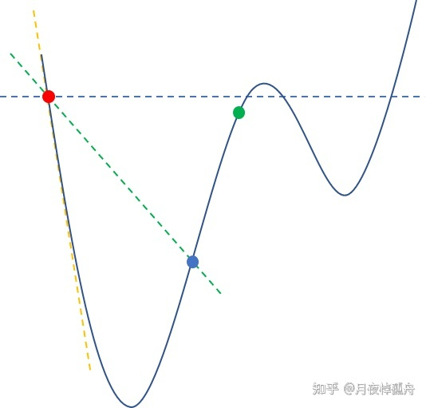
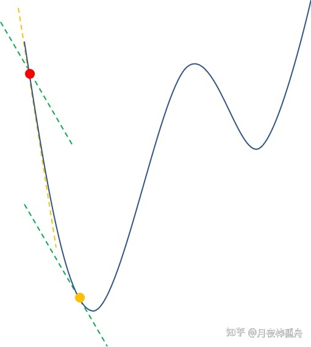

# 0. Wolfe Condition

1.Website
---------
1. https://mikl.dk/post/2019-wolfe-conditions/
2. https://zhuanlan.zhihu.com/p/496917103

# 1. Line Search Method

1. 用 line search method 解决无约束优化问题，关键迭代步骤可以整理成：
$$\begin{aligned}
x_{k+1} = x_k + \alpha_k p_k
\end{aligned}$$
    - $\alpha_k$: 搜索步长 (`Wolfe condition` 求解得到)
    - $p_k$: 搜索方向 (可以用 `BFGS` 求解得到)
    - 需要满足 $\nabla f_k^T p_k < 0$
2. 对于步长 $\alpha_k$ 的确认，直观上那就是沿着 $p_k$ 找到是目标函数 $f$ 最小的步长：
$$\begin{aligned}
\min_{\alpha_k}{f(x_k + \alpha_x p_k)}
\end{aligned}$$
3. 但这里就涉及到一个权衡问题，想要得到上式的精确解 $\alpha_k^*$ 是个十分困难的任务。我们是通过`迭代的方法`来求解 $\alpha_k$ 的`最优解`.
    - 在每次迭代中都要解决这样一个任务是难以接受的。而且即使计算得到了 $\alpha_k^*$，这也`只是第k次迭代的最优解`，对于整个优化问题来说并非关键的。
    - 算法总的效率取决于迭代次数和每次迭代的代价，求解 $\alpha_k^*$ 花费了巨大的代价，但可能迭代次数减少的不多，那就得不偿失了。
    - 因此会选择花费很少的代价寻找一个差不多的步长 $\alpha$ ，使得目标函数能有充分的下降，虽然迭代次数会多一点，但总的代价反而更少。

# 2. `Wolfe Condition`

1. `Sufficient Decrease Condition (SDC)`
$$\begin{aligned}
f(x_k+\alpha_kp_k) \le f(x_k) + c_1\alpha_k\nabla f_k^T p_k
\end{aligned}$$
2. `Curvature condition (CC)`
$$\begin{aligned}
\nabla f(x_k+\alpha_k p_k)^T p_k \ge c_2 \nabla f_k^T p_k
\end{aligned}$$
3. $c_1$ 和 $c_2$需要满足：$$0 < c_1 < c_2 < 1$$

## 2.1. Sufficient Decrease Condition (`SDC`)

1. 既然不要求得到精确 $\alpha_k^*$，只需要使`目标函数充分下降`，那么什么是充分下降呢? `充分下降我们会要求满足下面条件`：
$$\begin{cases}
f(x_k+\alpha_kp_k) \le f(x_k) + c_1\alpha_k\nabla f_k^T p_k \\
0 < c_1 < 1
\end{cases}$$
2. 将 $f(z)$ 视为 $\alpha$ 的函数: 
$$\Psi(\alpha) = f(x_k + \alpha p_k)$$
3. 下图的横坐标为 $\alpha$, 纵坐标为函数 $f$ 的值

4. 如图，`黄色虚线`为当前点的切线，也就是$f(x_k) + \alpha \nabla f^T_k p_k$，而`绿色虚线`就是$f(x_k) + c_1\alpha \nabla f_k^T p_k$. 可以充分下降条件要求可接受的 $\alpha$ 必须在`绿色虚线`以下，也就是红点与蓝点之间，从而排除了绿点。

## 2.2. `Curvature condition (CC)`

1. 我们说有了充分下降条件，可以使 $\alpha$ 有一定程度的下降，但这还不足够，试想当 $\alpha$ 非常小时，从图上可以看出是`满足充分下降`的，但这时候似乎并不太好，再往前走明明可以获得更大的下降，何乐而不为呢，因此便有了`曲率条件`来使得`步长又充分`的前进。
2. `CC condition`:
$$\begin{cases}
\nabla f(x_k + \alpha p_k)^T p_k \ge c_2\nabla f_k^T p_k \\
c_1 < c_2 < 1
\end{cases}$$
3. 

4. 曲率条件看起来就有点复杂了，其实 `cc condination`  的左边就是 $\alpha$ 当前点的斜率，右边就是起始点的斜率放宽松的结果，就是图中红点的绿色虚线，黄色点的斜率也为绿色虚线，黄色点就是不等式 `cc condination` 的临界点，之后便满足不等式，当然是在`下一个极大值之前(稍微往后一点也可以，只要满足不等式)`。
5. 那要怎样理解曲率条件呢？从图中也可以看出，刚刚离开红点时，斜率还是十分陡峭的，那就意味着目前在高速下降，此时我就应该抓住机会继续往前走，来获得更大的下降，`当走到什么时候才能认为不够陡峭呢`，那就把红点的切线放宽松点做为准则，也就是绿色虚线，当斜率比绿色虚线平缓时，就`认为下降速率不大了`，可以接受这段步长了。曲率条件就是通过这样的方式来`避免了小步长`，`当能高速下降时，迫使你往前走`。

