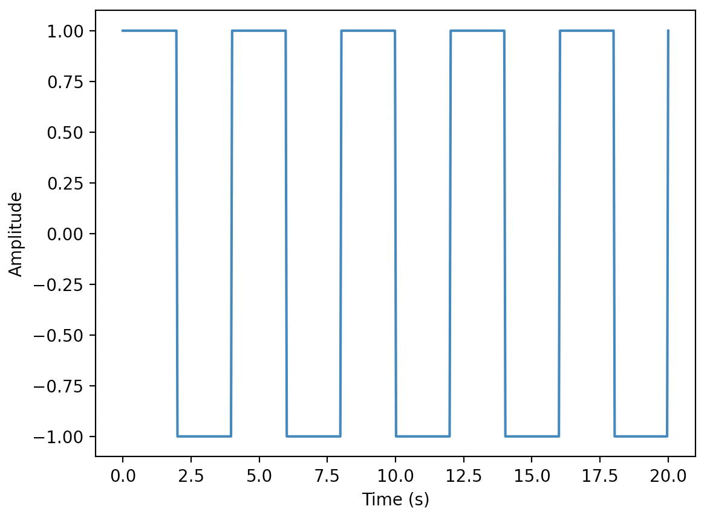

<!--
 * @Author: Uper 41718895+Hyliu-BUAA@users.noreply.github.com
 * @Date: 2022-07-20 16:13:01
 * @LastEditors: Uper 41718895+Hyliu-BUAA@users.noreply.github.com
 * @LastEditTime: 2022-07-20 18:06:48
 * @FilePath: /Quantum_Mechanics/qm/9.傅里叶Basic.md
 * @Description: 这是默认设置,请设置`customMade`, 打开koroFileHeader查看配置 进行设置: https://github.com/OBKoro1/koro1FileHeader/wiki/%E9%85%8D%
-->
# 傅里叶分析
<font color="steelblue" size="4">

Net
---
https://pythonnumericalmethods.berkeley.edu/notebooks/chapter24.02-Discrete-Fourier-Transform.html

p.s.
----
无论是 $\sin$ 还是 $\cos$，统一用`正弦波（Sine Wave）`一词代表`简谐波`。

</font>


# 1. 什么是`频域`？/ 什么是`傅里叶分析`？
<font color="steelblue" size="4">

1. 以时间作为参照观察动态世界的方法，我们称之为`时域分析`。这是我们最熟悉的分析方法，因此我们通常认为万物随着时间不停地改变。如果我们用另一种方法观察世界，我们就会发现这个世界是永恒不变的，这个静止的世界就叫做`频域`。
2. <font color="red">任何`周期性函数`，都可以看做不同振幅、不同相位`正弦波的叠加`。</font>
3. `傅里叶分析`就是我们`贯穿时域与频域`的方法。傅里叶分析可以分为：
    - `傅里叶级数 (Fourier Serie)`
    - `傅里叶变换 (Fourier transformation)`

</font>


# 2. 傅里叶级数(`Fourier Series`)的频谱
## 2.1. `Fourier Series`
<font color="steelblue" size="4">

1. `Fourier series` is a way of approximating arbitrary function(`f(x)`) as an infinte sum of sines and cosines of increasingly high frequency that `provide an orthogonal basis for the space of solution functions`(函数解所在空间的`正交基`).
2. You will come across the terms `Fourier Series` and `Fourier Transformation` frequently. The difference between them is:
    - `Fourier Series (傅里叶级数)` is an expansion of `periodic singnal` as a `linear combination of sines and cosines`.
    - `Fourier Transformation (傅里叶变换)` is the process or function used to convert `singnals` from the `time domain` to `frequency domain`.
3. To vividly understand `how Fourier Series works the way we use in complex situations`, one must also understand the advanced topics:
    - Heat equations
    - Fourier Series
    - Complex Fourier Series
    - Discrete Fourier Transform (DFT)
    - Fast Fourier Transform (FFT)
    - Quantum Fourier Transform
    - Fourier Transform Spectroscopy, etc. 
4. In this shot, we will `only go through the basics` to understand:
    - `what Fourier Series is`
    - `how it is used`

</font>


## 2.2. Application of `Fourier Series`
<font color="steelblue" size="4">

1. The concepts of `Hilbert spaces` and `operator theory` are given mathematical foundation with the introduction of the `Fourier Series` concept.
2. `Fast Fourier Tranform (FFT)` enabled
    - real-time image
    - audio compression
    - global commuication networks.
3. In summary, the `FFT` has a more `substantial and noteworthy` role in shaping the modern world than any algorithm to date.

</font>


## 2.3. `Fourier Series` expansion (傅里叶级数展开)
<font color="steelblue" size="4">

1. The `fourier series function (f(x))` can be represented as a `periodic function`. Any function is periodic with period `L` if it exhibits the same pattern after interval L along the x-axis.
2. The approximation of `Fourier Series function`:
$$\begin{aligned}
f(x) = \frac{A_0}{2} + \sum_{k=1}^{\infty}{( A_k\cos{\frac{2\pi kx}{L}} + B_k\sin{\frac{2\pi kx}{L}}) }
\end{aligned}$$
    - $ A_0 = \frac{1}{\pi}\int_{-\pi}^{\pi}{f(x)dx} $
    - $ A_k = \frac{1}{\pi}\int_{-\pi}^{\pi}{f(x)\cos{kx}dx} $
    - $ B_k = \frac{1}{\pi}\int_{-\pi}^{\pi}{f(x)\sin{kx}dx} $

</font>

# 3. Demos: `Fourier Series`
## 3.1. Demo 1: `Square wave function`
<font color="steelblue" size="4">

1. Usage for `scipy.signal.square()`
```python
import numpy as np
import matplotlib.pyplot as plt
from scipy.signal import square


start_point = 0
end_point = 20
L = end_point - start_point  # 时间的总长
number_points = 500
wave_ampitude = 1
frequency = 5   # `start_point`~`end_point`之间的周期个数
duty = 0.5  # value +1 from 0 to 2*pi*duty and -1 from 2*pi*duty to 2*pi

ts_lst = np.linspace(start_point, end_point, number_points)
signals_lst = square(2 * np.pi * frequency / L * ts_lst, duty=duty)

plt.plot(ts_lst, signals_lst)
plt.xlabel("Time (s)")
plt.ylabel("Amplitude")
plt.show()
```
Output:


</font>

```python

```